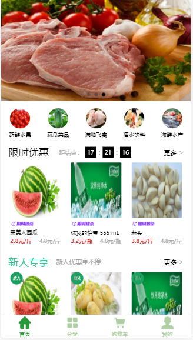
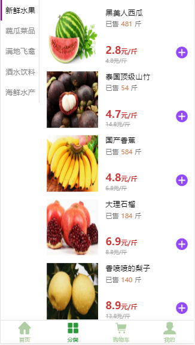
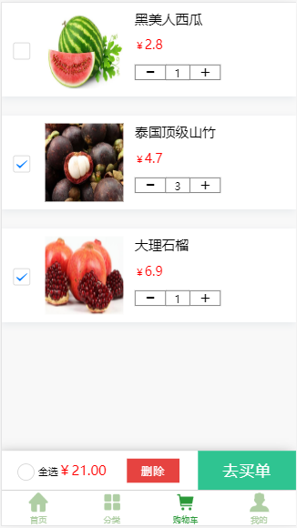
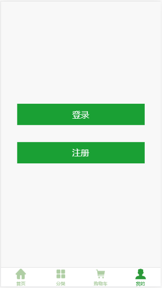
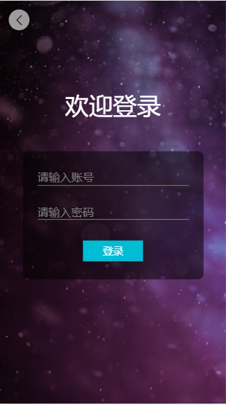

# quick-customer

### 介绍

速客优鲜，一个完整的前后端 JS 栈项目，前端基于 uni-app 实现，后端基于 express 实现

<div>

&nbsp;

&nbsp;

&nbsp;

&nbsp;

&nbsp;

</div>

### 安装

```
npm i
```

### 使用

- 1、将 skyx.sql 导入本地数据库

&emsp;&emsp;修改 server/config/index.js 的用户名和用户密码，确保能连上数据库

- 2、启动服务端

```
cd server && node app.js
```

- 3、通过 Hbuilder X 启动客户端（浏览器/小程序/APP）

### 前端目录结构

```
app
    --components (公共组件)
        --goodItem.vue (商品类目组件)
    --http (http请求)
        --AxiosConfig.js (axios配置)
        --HttpService.js (请求方式和资源路径配置)
        --PathConfig.js (接口地址配置)
        --ServerBase.js (axios请求封装)
    --pages (页面组件)
        --home (首页)
            --index.vue (首页入口)
        --good (商品)
            --detail.vue (商品详情)
        --classify (商品)
            --index.vue (分类入口)
        --shopCart (购物车)
            --index.vue (购物车入口)
        --mine (我的)
            --index.vue (我的入口)
            --login.vue (登录)
            --register.vue (注册)
    --static (静态目录)
        --iconfont.css (图标字体)
        --reset.css (样式重置)
    --router (路由目录)
        --config.js (路由配置)
        --index.js (路由入口)
    --utils (工具目录)
        --index.js (工具库)
```

### 后端目录结构

- 数据库采用 mysql
- ORM 框架 sequelize

```
server
    --config(配置目录)
        --index.js (数据库配置入口)
    --config(模型目录)
        --goods.js (商品模型)
        --users.js (用户模型)
    --router (路由目录)
        --action (路由操作)
        --index.js (路由入口)
    --app.js (项目集成入口)
```
